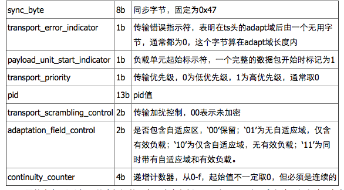
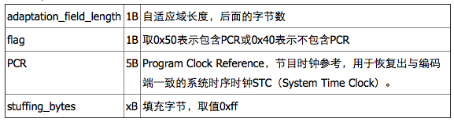
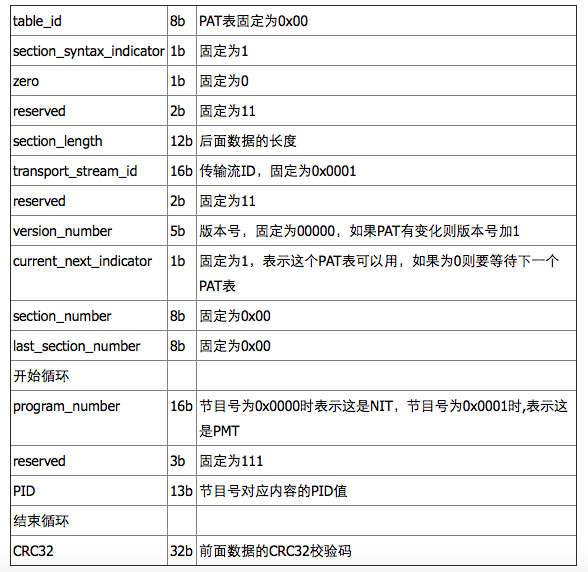
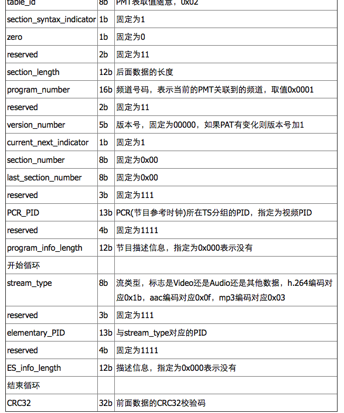
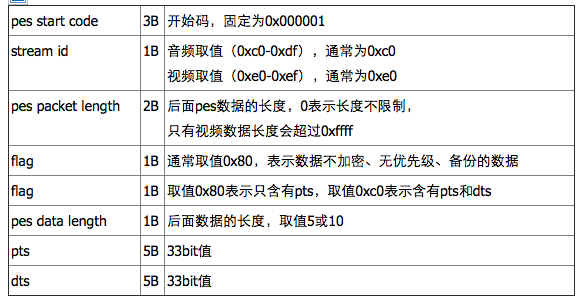

# 1 绪论

## 1.1课题研究背景
-------------

随着流媒体技术的高速发展，视频直播已经走入了千家万户。视频直播是指利用互联网及流媒体技术进行直播，视频因融合的图、文字、声音等丰富元素，声形并茂，效果极佳，逐渐成为互联网的主流表达方式。视频通过真实、生动的传播，营造出强烈的现场感，吸引眼球，印象深刻、记忆持久的传播效果。
视频点播是二十世纪90年代在国外发展起来的，英文成为“Video on Demand”，顾名思义，就是根据观众的要求播放节目的视频点播系统，把用户所点击或选择的视频内容，视频点播业务是计算机技术、网络通信技术、多媒体技术、电视技术和数字压缩技术等多领域融合的产物。
近年来，随着互联网技术的高速发展，网络网络直播迅速发展成为一种新的互联网文化业态，据中国投资资讯网发布的《2016-2020年中国网络直播行业深度调研及投资前景预测报告》显示：网络直播行业在影响力，经济收入、用户人数等方面都发展较快。2015年，国内网络直播时长规模约为90亿元，平台数量将近200家，周波平台用户数量达到近2亿，大型直播平台每日高峰时段同时在线人数接近400万，同时进行直播的房间超过3000个。网络直播作为一种新的媒介形态，随着视频直播门槛的降低和交互方式的多元化，越来越多的人接受这种传播形式，直播队伍逐步扩大，也预示着全民直播时代终将到来。

1.2 课题研究意义
--------------
本课题在基于国家数据广播中心原有的系统的基础上，进一步实现了支持多人收看电视直播与回看节目的一整套解决方案，以满足我国南海岛礁住户观看电视节目的日常需求。该系统可以将卫星采集下来的高清电视节目通过流媒体服务器，变为可供观看的视频流。同时设计一套回看录制系统，将电视直播节目录制成视频文件供用户点播。最后，跨平台的视频播放器保证用户可以随时随地观看到视频节目。

## 1.3 作者的主要工作
------------------

作者在已有的视频编码设备的基础上，完成了整套系统的设计与实现。包括整体软件的架构设计、回看服务器软件设计与开发，数据库设计，节目管理系统的设计与开发以及各个平台播放器客户端的设计与开发。

## 1.4 论文的组织结构
-------------------
论文共分为六章：
第一章 绪论，介绍课题的应用背景与研究现状，选题意义与研究价值，以及作者的主要工作；
第二章 相关理论介绍，主要介绍了TS流格式，RTMP和HLS流协议。
第三章 整体方案设计，概述了整套系统的设计思路；
第四章 介绍服务器程序的设计与实现
第五章 介绍客户端播放器的设计与实现
第六章 系统的测试与分析
第七章 总结与展望

#2 相关理论
##2.1 TS流格式
-----------------

TS流是MPEG-2标准中定义一种用于直播的码流结构，具有很好的容错能力。ts流最早应用于数字电视领域，其格式非常复杂包含的配置信息表多大十几个，视频格式主要是mpeg2。苹果公司发明的http live stream流媒体是基于ts文件的，不过他大大简化了传统的ts流，只需要2个最基本的配置表PAT和PMT，再加上音视频内容就可以了，hls流媒体视频编码的主要格式为h264/mpeg4，音频为aac/mp3。
ts文件分为三层：ts层（Transport Stream）、pes层（Packet Elemental Stream）、es层（Elementary Stream）。es层就是音视频数据，pes层是在音视频数据上加了时间戳等对数据帧的说明信息，ts层是在pes层上加入了数据流识别和传输的必要信息。

ts包大小固定为188字节，ts层分为三个部分：ts header、adaptation field、payload。ts header固定4个字节；adaptation field可能存在也可能不存在，主要作用是给不足188字节的数据做填充；payload是pes数据。

ts header

ts层的内容是通过PID值来标识的，主要内容包括：PAT表、PMT表、音频流、视频流。解析ts流要先找到PAT表，只要找到PAT就可以找到PMT，然后就可以找到音视频流了。PAT表的PID值固定为0。PAT表和PMT表需要定期插入ts流，因为用户随时可能加入ts流，这个间隔比较小，通常每隔几个视频帧就要加入PAT和PMT。PAT和PMT表是必须的，还可以加入其它表如SDT（业务描述表）等，不过hls流只要有PAT和PMT就可以播放了。

* PAT表：他主要的作用就是指明了PMT表的PID值。
* PMT表：他主要的作用就是指明了音视频流的PID值。
* 音频流/视频流：承载音视频内容。

adaption

自适应区的长度要包含传输错误指示符标识的一个字节。pcr是节目时钟参考，pcr、dts、pts都是对同一个系统时钟的采样值，pcr是递增的，因此可以将其设置为dts值，音频数据不需要pcr。如果没有字段，ipad是可以播放的，但vlc无法播放。打包ts流时PAT和PMT表是没有adaptation field的，不够的长度直接补0xff即可。视频流和音频流都需要加adaptation field，通常加在一个帧的第一个ts包和最后一个ts包里，中间的ts包不加。

PAT

PMT

PES

pts是显示时间戳、dts是解码时间戳，视频数据两种时间戳都需要，音频数据的pts和dts相同，所以只需要pts。有pts和dts两种时间戳是B帧引起的，I帧和P帧的pts等于dts。如果一个视频没有B帧，则pts永远和dts相同。从文件中顺序读取视频帧，取出的帧顺序和dts顺序相同。dts算法比较简单，初始值 + 增量即可，pts计算比较复杂，需要在dts的基础上加偏移量。
音频的pes中只有pts（同dts），视频的I、P帧两种时间戳都要有，视频B帧只要pts（同dts）。打包pts和dts就需要知道视频帧类型，但是通过容器格式我们是无法判断帧类型的，必须解析h.264内容才可以获取帧类型。

点播视频dts算法：
dts = 初始值 + 90000 / video_frame_rate，初始值可以随便指定，但是最好不要取0，video_frame_rate就是帧率，比如23、30。
pts和dts是以timescale为单位的，1s = 90000 time scale , 一帧就应该是90000/video_frame_rate 个timescale。
用一帧的timescale除以采样频率就可以转换为一帧的播放时长

点播音频dts算法：
dts = 初始值 + (90000 * audio_samples_per_frame) / audio_sample_rate，audio_samples_per_frame这个值与编解码相关，aac取值1024，mp3取值1158，audio_sample_rate是采样率，比如24000、41000。AAC一帧解码出来是每声道1024个sample，也就是说一帧的时长为1024/sample_rate秒。所以每一帧时间戳依次0，1024/sample_rate，...，1024*n/sample_rate秒。

直播视频的dts和pts应该直接用直播数据流中的时间，不应该按公式计算。

##2.2 RTMP协议
--------------------
RTMP协议是Real Time Message Protocol(实时信息传输协议)的缩写，它是由Adobe公司提出的一种应用层的协议，用来解决多媒体数据传输流的多路复用（Multiplexing）和分包（packetizing）的问题。随着VR技术的发展，视频直播等领域逐渐活跃起来，RTMP作为业内广泛使用的协议也重新被相关开发者重视起来。

RTMP协议是应用层协议，是要靠底层可靠的传输层协议（通常是TCP）来保证信息传输的可靠性的。在基于传输层协议的链接建立完成后，RTMP协议也要客户端和服务器通过“握手”来建立基于传输层链接之上的RTMP Connection链接，在Connection链接上会传输一些控制信息，如SetChunkSize,SetACKWindowSize。其中CreateStream命令会创建一个Stream链接，用于传输具体的音视频数据和控制这些信息传输的命令信息。RTMP协议传输时会对数据做自己的格式化，这种格式的消息我们称之为RTMP Message，而实际传输的时候为了更好地实现多路复用、分包和信息的公平性，发送端会把Message划分为带有Message ID的Chunk，每个Chunk可能是一个单独的Message，也可能是Message的一部分，在接受端会根据chunk中包含的data的长度，message id和message的长度把chunk还原成完整的Message，从而实现信息的收发。
要建立一个有效的RTMP Connection链接，首先要“握手”:客户端要向服务器发送C0,C1,C2（按序）三个chunk，服务器向客户端发送S0,S1,S2（按序）三个chunk，然后才能进行有效的信息传输。RTMP协议本身并没有规定这6个Message的具体传输顺序，但RTMP协议的实现者需要保证这几点：

* 客户端要等收到S1之后才能发送C2
* 客户端要等收到S2之后才能发送其他信息（控制信息和真实音视频等数据）
* 服务端要等到收到C0之后发送S1
* 服务端必须等到收到C1之后才能发送S2
* 服务端必须等到收到C2之后才能发送其他信息（控制信息和真实音视频等数据） 
* 如果每次发送一个握手chunk的话握手顺序会是这样：

Chunk Stream是对传输RTMP Chunk的流的逻辑上的抽象，客户端和服务器之间有关RTMP的信息都在这个流上通信。这个流上的操作也是我们关注RTMP协议的重点。

3.1 Message(消息)

这里的Message是指满足该协议格式的、可以切分成Chunk发送的消息，消息包含的字段如下：

Timestamp（时间戳）：消息的时间戳（但不一定是当前时间，后面会介绍），4个字节
Length(长度)：是指Message Payload（消息负载）即音视频等信息的数据的长度，3个字节
TypeId(类型Id)：消息的类型Id，1个字节
Message Stream ID（消息的流ID）：每个消息的唯一标识，划分成Chunk和还原Chunk为Message的时候都是根据这个ID来辨识是否是同一个消息的Chunk的，4个字节，并且以小端格式存储

3.2 Chunking(Message分块)
RTMP在收发数据的时候并不是以Message为单位的，而是把Message拆分成Chunk发送，而且必须在一个Chunk发送完成之后才能开始发送下一个Chunk。每个Chunk中带有MessageID代表属于哪个Message，接受端也会按照这个id来将chunk组装成Message。 
为什么RTMP要将Message拆分成不同的Chunk呢？通过拆分，数据量较大的Message可以被拆分成较小的“Message”，这样就可以避免优先级低的消息持续发送阻塞优先级高的数据，比如在视频的传输过程中，会包括视频帧，音频帧和RTMP控制信息，如果持续发送音频数据或者控制数据的话可能就会造成视频帧的阻塞，然后就会造成看视频时最烦人的卡顿现象。同时对于数据量较小的Message，可以通过对Chunk Header的字段来压缩信息，从而减少信息的传输量。（具体的压缩方式会在后面介绍） 
Chunk的默认大小是128字节，在传输过程中，通过一个叫做Set Chunk Size的控制信息可以设置Chunk数据量的最大值，在发送端和接受端会各自维护一个Chunk Size，可以分别设置这个值来改变自己这一方发送的Chunk的最大大小。大一点的Chunk减少了计算每个chunk的时间从而减少了CPU的占用率，但是它会占用更多的时间在发送上，尤其是在低带宽的网络情况下，很可能会阻塞后面更重要信息的传输。小一点的Chunk可以减少这种阻塞问题，但小的Chunk会引入过多额外的信息（Chunk中的Header），少量多次的传输也可能会造成发送的间断导致不能充分利用高带宽的优势，因此并不适合在高比特率的流中传输。在实际发送时应对要发送的数据用不同的Chunk Size去尝试，通过抓包分析等手段得出合适的Chunk大小，并且在传输过程中可以根据当前的带宽信息和实际信息的大小动态调整Chunk的大小，从而尽量提高CPU的利用率并减少信息的阻塞机率。

 

##2.3 HLS协议
--------------------

HTTP Live Streaming（缩写是HLS）是一个由苹果公司提出的基于HTTP的流媒体网络传输协议。是苹果公司QuickTime和iPhone软件系统的一部分。它的工作原理是把整个流分成一个个小的基于HTTP的文件来下载，每次只下载一些。当媒体流正在播放时，客户端可以选择从许多不同的备用源中以不同的速率下载同样的资源，允许流媒体会话适应不同的数据速率。在开始一个流媒体会话时，客户端会下载一个包含元数据的extended M3U (m3u8)playlist文件，用于寻找可用的媒体流。
HLS只请求基本的HTTP报文，与实时传输协议（RTP)不同，HLS可以穿过任何允许HTTP数据通过的防火墙或者代理服务器。它也很容易使用内容分发网络来传输媒体流。
苹果公司把HLS协议作为一个互联网草案（逐步提交），在第一阶段中已作为一个非正式的标准提交到IETF。但是，即使苹果偶尔地提交一些小的更新，IETF却没有关于制定此标准的有关进一步的动作。

HLS协议规定：

视频的封装格式是TS。
视频的编码格式为H264,音频编码格式为MP3、AAC或者AC-3。
除了TS视频文件本身，还定义了用来控制播放的m3u8文件（文本文件）。
HLS主要是为了解决RTMP协议存在的一些问题。比如RTMP协议不使用标准的HTTP接口传输数据，所以在一些特殊的网络环境下可能被防火墙屏蔽掉。但是HLS由于使用的HTTP协议传输数据，不会遇到被防火墙屏蔽的情况（该不会有防火墙连80接口都不放过吧）。
另外于负载，RTMP是一种有状态协议，很难对视频服务器进行平滑扩展，因为需要为每一个播放视频流的客户端维护状态。而HLS基于无状态协议（HTTP），客户端只是按照顺序使用下载存储在服务器的普通TS文件，做负责均衡如同普通的HTTP文件服务器的负载均衡一样简单。
另外HLS协议本身实现了码率自适应，不同带宽的设备可以自动切换到最适合自己码率的视频播放。其实HLS最大的优势就是他的亲爹是苹果。苹果在自家的IOS设备上只提供对HLS的原生支持，并且放弃了flash。Android也迫于平果的“淫威”原生支持了HLS。这样一来flv，rtmp这些Adobe的视频方案要想在移动设备上播放需要额外下点功夫。当然flash对移动设备造成很大的性能压力确实也是自身的问题。

#2 整体方案设计

## 2.1 系统方案设计
----------------
系统由前端、边缘服务器及用户构成。blablabla 
整体系统框图如图所示

 

###### 前端功能
1. 卫星直转系统接收来自卫星的电视节目及自办节目，重新编码为低码率H.264直播流，分发到直播服务器。
2. 直播服务器为流媒体服务器，
3. 提供DNS域名解析服务，采集边缘服务器状态，指导用户连接到合适的边缘服务器
4. 提供NTP服务，为整个网络提供基于GPS的时间基准
5. 提供热备份。

##### 边缘服务器功能
1. 边缘服务器具备双网口，跨网段使用；
2. 主干网口连接主干网，接收直播流、同步点播节目及接收EPG；
3. 子网段口连接子网段，提供不高于3000路并发的直播、回看、点播服务；
4. 主干网口也可提供不高于300路并发的直播、回看、点播服务。

##### 用户功能及种类
1. 用户位于子网段内，通过网页或APP访问TV.com，观看直播、回看、点播节目；
2. 用户终端支持电脑、平板及苹果手机的网页访问，安卓盒子及手机的APP访问；
3. 子网段内可挂接多个WIFI无线路由器，提供无线访问能力。

------------------------

网络拓扑图如图所示

主（备）前端连主干网，提供直播流、点播节目、DNS（域名解析）、EPG（电子节目单）及NTP（网络时间协议）服务。外部4G信号接入前端，提供EPG及远程维护功能。
边缘服务器具备双网口，一端连主干网，接收直播流；另一端连子网段，提供直播、回看、点播服务。当子网段用户过多时，可安装多套边缘服务器。
     
用户分布于各个子网段内，通过前端DNS解析，得到最近的边缘服务器IP，进而申请直播、回看、点播服务。当访问主前端失败时，可自动访问备份前端。

前端由卫星直转系统，电视转码系统，高清编码系统和播出服务器系统构成。

------------------------

## 2.2 前端系统
前端系统完成IPTV及数字电视播出。为可靠起见，前端系统采用双备份，在主前端故障时，IPTV会自动切换到备份前端，数字电视系统需要手动切换。如图所示

 

前端完成IPTV及数字电视播出，输入为卫星电视与4G信号，输出为有线电视RF信号及IPTV万兆光接口。
前端网络分为内外两张网，内网完成核心的电视转码系统及高清编码系统；外网提供主直播/点播服务和主干网其它服务。内网通过路由器与外网连接，以保证内网的安全可靠性。
内网通过管理服务器接入4G信号，实现外部远程系统管理和EPG获取。
前端分为主前端与备份前端，两者结构相同，相应IP地址不同，方便用户及边缘服务器自动切换。

##### 卫星直转系统
卫星直转系统介绍见“岛礁有线电视方案”，主要完成100套卫星节目接收，解调，拼接，调制，最终输出为有线电视RF信号。
IPTV系统节目源大部分来自卫星直转系统，通过系统改造，将节目通过增加的ASI接口输出至“数字电视转IP”单元。
     
##### 电视转码系统
电视转码系统由数字电视IP转换及转码机两部分构成，数字电视IP转换接收ASI输入的多套MCPC电视节目，转为SCPC的单节目UDP流，发送到指定的转码机；转码机完成多路UDP节目接收、视音频解码，H.264视频/AAC音频编码，通过RTMP协议发送到直播服务器。
单台数字电视转IP完成6路ASI接收，本系统有12路ASI流，需要2台数字电视IP转换设备；单台转码机完成16套标清或8套高清节目转码，需5台转码机完成80套节目实时转码。

##### 高清编码系统
高清编码系统由32台高清机顶盒和或HDMI高清编播系统（自办高清直播节目），2主2从高清编码机，蓝网、广播接收机构成。完成32套高清统计复用编码，同时插入蓝网、广播节目，输出的ASI送到直转系统调制器，输出的IPTV通过RTMP协议发送到直播服务器。

##### 播出服务器
播出服务器由直播服务器、点播服务器、DNS/EPG/NTP服务器构成。
直播服务器完成100套IPTV节目RTMP接收及向多个边缘直播服务器分发功能；
点播服务器完成点播节目及蓝色海疆数据广播节目接收、存储及与边缘点播服务器同步；  
DNS服务器完成DNS域名解析及边缘服务器信息收集与配置，返回用户合适边缘服务器的IP地址；
EPG服务器通过4G得到外部实时EPG，为边缘的回看服务器自动录制提供电子节目单。EPG是一个实时动态数据库，需要购买及长期人工维护；
NTP服务器通过GPS/北斗校时，为系统提供精确可靠的时间信息；
另外，播出系统还配备管理服务器，通过4G远程配置与监视系统工作。
   

##### 前端网络布局
 前端网络分为内外两张网，内网完成核心的电视转码系统及高清编码系统；外网提供主直播/点播服务和主干网其它服务。内网通过路由器与外网连接，以保证内网的安全性。
内网通过管理服务器接入4G信号，实现外部远程系统管理和EPG获取。
前端分为主前端与备份前端，两者结构相同，功能相同，仅IP地址不同，互为热备份。
 

------------------------------

本课题在已有的卫星只转系统与电视转码系统的基础上，进一步实现岛礁直播点播系统以供岛礁上的用户可以方便的观看直播与点播的电视节目。
系统用例图如图所示

# 3  直播与回看服务器的设计与实现
-----------------------------
## 3.1 直播与回看管理软件的设计与实现
--------------------------------

### 3.1.1 系统需求分析
-----------------
对系统进行基本的需求分析之后，可知该管理软件至少应该具有如下功能： 
1. 系统管理员可以添家直播频道的信息。
2. 系统管理员可以删除直播频道的信息。
3. 系统管理员可以编辑直播频道的信息。
4. 系统管理员可以启动回看节目的录制。
5. 系统管理员可以停止回看节目的录制。
6. 系统管理员可以监控回看节目的录制情况。

通过对系统需求的分析，可以确定该系统的参与者即为系统管理员。可以确定系统中有如下用例存在。 

1. Add Channel Info（添加直播频道信息） 
本用例提供了添加直播频道信息的功能
2. Delete Channel Info（删除直播频道信息） 
本用例提供了删除直播频道信息的功能。
3. Edit Channel Info （编辑直播频道信息） 
本用例提供了编辑直播频道信息的功能。
4. Start Replay (启动回看节目录制) 
本用例提供了启动回看节目录制的功能。
5. Stop Replay(停止回看节目录制) 
本用例提供了停止回看节目录制的功能。

系统用例图如图所示：

### 3.1.2 定义系统对象
-----------------------
定义完系统需求，就可以根据系统需求来识别系统中存在的对象了。系统对象的识别可以通过寻找系统域描述和需求描述中的名词来进行。从这些对象翅中筛选，如果有与该对象相关的身份和行为，那么久应该为之创建类。
1. 类Channel 
类Channel代表直播频道的信息。直播频道的信息包括频道的唯一id、名称、直播流的地址。 类Channel应该具有下列私有属性。 
channel_id:String  
直播频道的唯一id 
channel_name:String  
直播频道的名称 
url:String  
直播流的地址 
active:boolean 
激活状态 
start:boolean 
回看节目的录制状态 

在确定Channel的公共操作包括如下：

query()
查询是否存在对应的直播频道信息。

update()  
更新直播频道信息的内容，如改变频道名称，直播流地址以及激活状态和录制状态。

2. 类Program  
类Program代表回看节目的信息。类Program应该具有下列私有属性 

在确定Channel的方法时，应考虑如下需求：
add()
增加一条回看节目信息

delete()
删除指定的回看节目

### 3.1.3 数据库的设计与实现
-------------------------
本系统共有两个实体类，即类Channel与类Program。类Channel与类Program为一对多的关联关系。

根据已有需求，建立数据库模型。数据库的逻辑模型如下图所示。本系统使用关系型数据库存储和管理数据。关系表的UML符号用衍型为<<retional table>>的类符号表示，带有衍型<<pk>>的属性代表主键，带有<<fk>>的属性代表外键。

本系统数据库共有两个表，channel中表包含了所有频道的数据。其中“channel_id”为描述频道的唯一id，“channel_name”为频道名字，“rtmp_url”为直播流的url地址，“active”为激活标志，“start”为是否启动录制回看节目的标志。program存储所有回看节目的数据，其中“channel_id”为描述频道的唯一id，“start_time”与“end_time”为回看节目的起始时间与结束时间，“url”为录制节目的url地址，“finished”为录制成功的标志位，”title”为回看节目的名称。 
channel表与program表为一对多的关系。channel表与program表之间的一对多关系通过在表program中插入外检“channel_id”以匹配channel表中的“channel_id”来模拟。

创建好数据库之后，需要对数据库的进行初始化： 

### 3.1.4 定义用户界面类
----------------------
系统管理员与系统需要交互，一个用户友好的系统通常都采用直观的图形化界面，因此需要定义系统的用户界面类。

1. 类TSTable
TSTable是系统的主界面，为一个显示直播频道信息的列表。每一行显示的是直播频道信息，其中包括直播频道的id、名称、直播流的地址，回看录制机ip等信息。每条信息都提供编辑删除按钮。点击按钮上便可以编辑或删除该条信息。同时，每条直播频道信息都有一个录制按钮，当按下录制按钮时，启动回看录制程序。再次按下停止。界面如图所示： 

公共方法如下： 
newTSTable() : void 
创建系统主界面。 
edit() : void 
当按下“编辑”按钮时，该方法被调用，编辑对应的直播频道信息。 
delete() : void 
当按下“删除”按钮时，该方法被调用，删除对应的直播频道信息。 
addChannel() : void 
当按下“添加”按钮时，该方法被调用，添加一条新的直播频道信息。 
start() : void  
当按下“录制”按钮时，该方法被调用
stop() : void  
当处于录制状态按下“录制”按钮时，该方法被调用。

2. 类AddDialog
界面类AddDialog是用来添加一条新的直播频道信息。当按下TSTable中的“添加”按钮时，对话框AddDialog弹出，管理员填写相关的直播频道信息，点击“提交”按钮，便可将该条信息添加到系统数据库中并显示出来。界面如图所示： 

类AddDialog具有如下方法： 
newDialog() : void 
创建添加窗口 
add() : void 
当添加窗口被提交时，该方法被调用。

3. 类EditDialog
界面类EditDialog的功能与AddDialog较为相似，用来重新编辑一条直播频道信息。当按下TSTable中的“编辑”按钮时
，弹出EditDialog对话框。管理员修改相关的信息，点击“提交”按钮，便可以修改该条直播频道信息。 
类EditDialog具有如下方法
newDialog() : void  
创建编辑窗口  
edit() : void  
当编辑窗口被提交时，该方法被调用。

### 3.1.5 直播与回看管理软件的具体实现
---------------------------------
描述本系统用例场景的时序图如下： 

添加直播频道信息的时序图如图所示：  

当要添加直播频道信息时。管理员发送add()消息给类TSTable，类TSTable又发送newDialog()消息给类AddDialog,即类AddDialog的方法被调用，创建用于添加直播频道信息的对话框。管理员填写必要的信息之后提交信息，类AddDialog的方法add()被调用，发送消息给Channel类，首先调用Channel类中的query方法，确认数据库中是否存在该条信息，如若存在（若不存在，则显示提示信息）,则调用add方法，更新并激活该条信息。

编辑与删除直播频道信息的流程与添加直播频道信息的流程类似。不同的是TSTable所调用的方法分别为edit与delete方法。 
启动与停止录制回看视频的时序图如图所示： 

当要启动或停止录制回看视频时，管理员发送send()消息给类TSTable，类TSTable通过当前显示状态判断是进行启动还是停止操作，接着，类TSTable发送start或者stop命令给管理服务器，最后管理服务器发送start或者stop命令给远程的回看录制服务器。最后回看录制服务器返回程序执行的结果，并显示在用户界面上。

### 3.1.6 播放接口设计
------------------------------------
除了管理回看节目的管理与启动之外，本软件还要负责提供一套供客户端播放器进行播放的数据接口。接口定义如下：

        function get_channels()
        function get_videos(string channel_id,int day)
        
其中，函数get_channels返回当前所有可用的频道信息。函数get_videos则返回指定天数的回看视频信息。客户端获取数据时使用该数据接口调用顺序如下：首先，调用get_channels函数，该函数将返回所有数据库中active项等于1的直播信息，接着，客户端遍历所有的直播频道，在每个直播频道中使用get_video函数获取最近7天的回看节目信息，返回的数据中，如果字段finished为1，则显示在界面上待用户点击观看。
        

## 3.2 EPG同步服务器的设计与实现
-------------------------------

### 3.2.1 EPG简介
----------------
EPG 是Electronic Program Guide的英文缩写，意思是电子节目指南。 IPTV所提供的各种业务的索引及导航都是通过 EPG系统来完成的。 IPTV EPG实际上就是 IPTV的一个门户系统。 EPG系统的界面与 Web页面类似，在 EPG界面上一般都提供各类菜单、按钮、链接等可供用户选择节目时直接点击的组件； EPG的界面上也可以包含各类供用户浏览的动态或静态的多媒体内容。
EPG的主要作用就是用户利用EPG提供的菜单，可以选择自己喜欢的组播频道；点播自己喜欢的视频节目；在线演唱自己喜欢的歌曲；查找IPTV提供的各种信息，包括生活信息、娱乐信息、教育信息、体育信息等等；用户也可使用EPG提供的菜单来订购自己喜欢的节目；甚至可以通过EPG提供的菜单支付水费、电费、进行电子商务的交易等。用户还可以利用EPG菜单查看节目的附加信息，例如对节目内容介绍、演员及导演的介绍等。同时通过EPG菜单中提供的家长控制功能，家长可以对某些节目加以限制，不给孩子开放所有的观看权限。
EPG为IPTV提供的基本业务(如VOD点播/KTV/歌曲)及各种增值业务的使用提供了简单方便的操作平台，为IPTV用户收看电视节目、享受多媒体节目点播以及开展信息服务提供了一个良好的导航机制。使用EPG系统可使用户能够方便快捷地找到自己关心的节目。使用EPG系统，用户通过电视机这个终端和IP机顶盒就可以登陆Internet。更重要的是使用EPG系统用户就可以和电视进行互动，这样用户就不再被动地接收信息，用户可以及时、主动地发表自己的意见和看法，并将这些意见和看法及时反馈给内容制作商。因此EPG在IPTV系统中起着十分重要的作用。

### 3.2.2 EPG同步服务器系统接口设计
----------------------------
EPG同步服务器主要实时同步100套电视直播节目的EPG信息，并对外提供相应的数据接口。EPG同步服务器的系统框图如图所示：

首先，服务器每隔一段时间，便从第三方数据源处获取实时的EPG更新数据。EPG同步服务器提供的数据接口如下：

		function
		function

		

## 3.3 直播服务器的设计与实现
--------------------------
### 3.3.1 开源流媒体服务器srs
--------------------------
SRS定位是运营级的互联网直播服务器集群，追求更好的概念完整性和最简单实现的代码。SRS提供了丰富的接入方案将RTMP流接入SRS，包括推送RTMP到SRS、拉取流到SRS。SRS还支持将接入的RTMP流进行各种变换，譬如直播流转码、转发给其他服务器、转封装成HLS、录制成FLV。SRS包含支大规模集群如CDN业务的关键特性，譬如RTMP多级集群、VHOST虚拟服务器、无中断服务Reload。此外，SRS还提供丰富的应用接口，包括HTTP回调、HTTP API接口、RTMP测速。SRS在源站和CDN集群中都得到了广泛的应用Applications。 

* 运营级： 
商业运营追求极高的稳定性，良好的系统对接，以及错误排查和处理机制。譬如日志文件格式，reload，系统HTTP接口，提供init.d脚本，转发，转码，边缘回多源站，都是根据CDN运营经验作为判断这些功能作为核心的依据。
* 互联网： 
互联网最大的特征是变化，唯一不变的就是不断变化的客户要求，唯一不变的是基础结构的概念完整性和简洁性。互联网还意味着参与性，听取用户的需求和变更，持续改进和维护。
* 直播服务器： 
直播和点播这两种截然不同的业务类型，导致架构和目标完全不一致，从运营的设备组，应对的挑战都完全不同。两种都支持只能说明没有重心，或者低估了代价。
* 集群： 
FMS(AMS)的集群还是很不错的，虽然在运营容错很差。SRS（Simple Rtmp Server）支持完善的直播集群，Vhost分为源站和边缘，容错支持多源站切换、测速、可追溯日志等。
* 概念完整性：
虽然代码甚至结构都在变化，但是结构的概念完整性是一直追求的目标。从SRS（Simple Rtmp Server）服务器，P2P，ARM监控产业，MIPS路由器，服务器监控管理，ARM智能手机，SRS（Simple Rtmp Server）的规模不再是一个服务器而已。
* 简单实现：
对于过于复杂的实现，宁可不加入这个功能，也不牺牲前面提到的要求。对于已经实现的功能的代码，总会在一个版本release前给予充分的时间来找出最简答案。不求最高性能，最优雅，最牛逼，但求最简单易懂。

与nginx-rtmp相比，SRS(Simple Rtmp Server)单进程能支持9000并发，nginx-rtmp单进程最多支持3000个，单进程的性能SRS(Simple Rtmp Server)是nginx-rtmp的三倍。srs针对直播服务器有如下优化：

第一点，st-load，这个是SRS(Simple Rtmp Sever)能做到高性能的最重要的原因，一个st-load可以模拟2000+的客户端。一个牛逼的benchmark的工具；如果没有st-load，如何知道系统的性能瓶颈在哪里？总不能打开3000个flash页面播放rtmp流吧？开启3000个ffmpeg来抓流？不靠谱。这就是高性能第一定律：高性能不是想象和猜测粗来的，而是测试、调试和改进粗来的。
第二点，gperf/gprof性能benchmark功能。在编译SRS(Simple Rtmp Sever)时，就可以打开gcp或者gprof的性能分析选项，灰常方便就可以拿到数据。缩短了改进和优化的开发周期。
第三点，引用计数的msgs避免内存拷贝。从编码器收到的video/audio数据，转换成SrsSharedPtrMessage放到每个连接的发送队列，避免每个都拷贝一次；因为发送给每个客户端的消息(不是chunked包)头可能不一样，譬如时间戳不一样，但是消息的payload是一样的。
第四点，使用writev发送chunked包，避免消息到chunked包的内存拷贝。可以开辟一个header的缓冲区，专门放每个chunked包的header，然后用iovc保存头的指针和大小，payload的指针和大小，用writev就可以一次发送。
第五点，mw(merged-write)技术，即一次发送多个消息。虽然每个消息使用writev可以避免拷贝，还有更高效的是一次发送多个消息，即把多个消息的chunked头写在header的缓冲区，iovc保存多个消息的chunked头和payload指针，一次writev发送多个消息。这个是最关键所在。
第六点，减少timeout recv，每个连接都是一个st-thread在服务。在发送之前，线程得尝试从连接收取消息，譬如客户端的stop之类的；所以只能recv时指定timeout，譬如300毫秒如果还没有收到消息，就发送连接队列中的消息。这个会导致st的timeout红黑树操作频繁。实际上，可以直接开启一个recv线程，因为客户端的消息非常少，避免timeout接收。
第七点，fast buffer和cache。譬如每次取消息的数组，使用cache；使用fast buffer避免频繁删除；使用header的cache。
第八点，vector还是list？有的地方看起来list更高效，譬如simple buffer这种频繁删除头，以及在结尾加入数据，看起来是list应该做的事情。但是实际上测试发现，vector比list高10%性能。所以，回到第一点，高性能不是猜测和想象粗来的；有的时候有些代码写得很慢，但是这个频率非常低，那么就不要考虑性能，而要考虑可读性。我觉得可以算是高性能第二定律：不要总是考虑高性能，可读性更重要。

### 3.2.2 流媒体协议分析

1 rtmp 

2 HLS 

### 3.2.2 srs的部署与使用
-----------------------

SRS主要运行在Linux系统上，譬如Centos和Ubuntu，包括x86、x86-64、ARM和MIPS。MacOS支持代码编辑和编译。
SRS的系统结构如图所示：

在下载源码、确定用什么编译选项后，编译SRS其实很简单。只需要RTMP和HLS：

  ./configure && make

指定配置文件，即可启动SRS：

  ./objs/srs -c conf/srs.conf
  
SRS启动之后，只需要将直播流以RTMP的形式推送到服务器上，便可以

## 3.3 回看服务器的设计与实现
--------------------------

### 3.3.1 系统分析
-----------------
在图xxx中，我们看到，系统管理员在回看管理软件中，点击“启动”按钮时，管理服务器会发送一条命令给回看服务器，此时，回看服务器便把指定的直播源根据EPG信息录制成回看视频文件并存放在回看服务器中。由此我们知道，回看服务器的主要功能便是从直播流中录制可供用户观看的电视节目。流程图如图所示，首先，回看服务器先从EPG同步服务器中将对应的EPG信息存储在本地数据库中，接着，回看服务器从指定的流中录制视频，并根据实时的EPG信息生成回看视频文件，最后讲生成的回看视频信息写入数据库中一遍用户进行观看。

从图中我们可以看到，实现回看服务器的关键便是从指定流中录制视频这一过程，既要考虑程序运行的稳定性、又要考虑生成视频格式的兼容性等等问题。在开发过程中，一共实现过过以下三个方案:

1. 将rtmp直播流录制成flv文件存储在本地http服务器。流程图如图所示：

初次启动录制时在命令行中输入脚本名后加入channel_id作为运行参数，以达到录制相应频道节目的目的。创建文件目录和程序运行日志，目录存在则跳过，日志如果存在则从最后一行开始记录。根据channel_id从channel表中获取RTMP码流地址并测试码流是否获取正常。如果测试失败则将数据库中运行状态和主进程号写0并终止程序，如果测试通过则将主进程号和运行状态1写入数据库并将进行下一步操作，从节目单接口获取跟channel_id相对应的XML格式节目数据，然后将其中有用的部分进行解析和处理后保存在数据库中。然后根据channel_id和当前系统时间，从刚刚保存在数据库的program表中找到符合当前时间的节目并准备开始录制。如果当前时间刚好处在两段节目中间的空档期时，则进入等待状态直到节目播出时间后再准备开始录制。
到达节目录制时间后，程序为当前节目文件创建临时文件名dump.flv和随机文件名变量，这是因为直接抓取的直播流数据文件没有节目的时长信息，在页面播放器中播放节目时会造成无法拖动的问题，所以每个节目录制时先以临时文件名dump.flv保存，待录制结束后注入元数据并生成最终的节目文件，然后删除临时文件。
然后再次以当前channel_id及日期创建文件夹和子文件夹，目的是解决节目循环录制过程中遇到日起变化的问题，如果文件夹已存在则跳过该步骤，创建当前节目文件的保存路径变量，创建码流录制命令变量，创建元信息注入命令变量，创建节目录制子进程变量，创建进程组号变量，完成上述操作后，开始录制节目文件。
录制节目进行中，每隔60秒进行节目剩余时间判断及码流判断，如果判断出现码流不正常，则跳出该录制子进程并重新开始录制，直到码流恢复正常为止。如果码流正常则继续录制，节目结束前60秒停止判断。结束后进行元信息注入并保存节目文件，删除临时录制文件，删除72小时前的节目单信息和节目文件，将录制好的节目地址及完成状态写入数据库中，结束录制子进程。完成上述步骤后后重新回到读取节目单信息的步骤，从节目单接口更新节目单数据，然后读取一条合适的节目信息并开始录制循环。如果节目单出现更新问题，无法获取新的节目单，则每隔30秒重试1次，共5次。5次获取节目单信息失败后程序等待30分钟再次重试5次，直到节目单接口能够正常获取数据为止。为了优化程序结构，便于管理维护，将录制部分的程序分为：录制脚本rtmpdump.py、数据库管理脚本db_manager.py及关闭脚本kill.py。软件整体框架

2. 将hls直播流中的ts文件重组，以m3u8索引文件的格式存储在本地http服务器中。由于hls直播流由一个个长度为10秒的ts文件组成。对ts文件进行简单拼接，存储在本地。再生成对应的m3u8文件，即可完成对直播视频的录制任务，流程图如图所示。 

初次启动录制时以程序输入的channel_id作为参数，以达到录制相应频道节目的目的。创建文件目录和程序运行日志，目录存在则跳过，日志如果存在则从最后一行开始记录。根据channel_id从channel表中获取RTMP码流地址，将RTMP码流地址映射为对应的hls码流地址并测试码流是否获取正常，如果测试失败则修改数据库中该频道的录制状态并终止程序。如果测试通过则进行下一步操作。程序创建一个新的进程，将原来长度为10秒的ts文件拼接，生成全新的长度为60秒的ts文件并存储在本地。与此同时，程序主进程每隔三十分钟对服务器中所有进行录制的频道进行如下操作：（1）从EPG同步服务器中更新最新的EPG信息到服务器中。（2）根据数据库中的EPG信息与本地存储的ts文件，生成对应的m3u8文件以供用户观看。（2）删除本地文件系统中陈旧的视频节目。

3. 将udp流文件录制成ts切片，以m3u8索引文件的形式存储在本地http服务器中。与方案二不同的是，视频录制的源的网络传输协议从hls变成了udp。

在经过大量的测试得知，对于节目时长过长的节目来说，方法1中使用rtmp录制下来的flv文件往往过大，这使得在网络传输中造成了不必要的带宽浪费。而且flv文件无法再苹果公司的ios平台浏览其中进行播放，影响了系统的兼容性。方法2将视频格式由flv编程了ts格式，解决了兼容性问题，但是由于其录制时会产生累计误差，导致录制时间与系统时间偏移较大。因此最终选用方案3中的方式进行录制。

### 3.3.2 回看服务器的程序实现
---------------------------
回来看服务器中的录制程序使用Python3.5进行编写，服务器选用flask框架用于与管理服务器进行通信。程序模块图如图所示：
录制程序共分为http服务器模块，数据库模块，EPG更新模块，日志模块以及主录制模块

1. 服务器模块
服务器模块主要负责创建http服务器与管理服务器通信。接收管理服务器发送来的录制信息并返回录制程序的状态。
服务器模块的主要方法如下。

        def status() 
        def start() 
        def kill() 

当管理服务器请求录制程序状态时，statu方法返回指定节目的录制状态，如“运行中”，“已停止”，“发生错误”等等。
当管理服务器发来开始录制请求时，该方法根据所请求的参数分别调用start和kill方法启动和停止节目的录制。

2. 数据库模块
数据库模块主要负责数据库相关操作。服务器模块包含的主要方法如下：

        def get_udp_port(channel_id)
        def set_start(channel_id,active)
        def get_available_program(channel_id,START_TIME)
        def delete_program(channel_id):
		def insert_program(event_id, channel_id, st, et, title)
		def delete_expire_program(channel_id,expire=8)
		
函数get_live_url主要负责根据输入的channel_id参数获取udp流端口信息信息。如果获取成功，则可以监听本机的该udp端口获取到待录制的视频流。函数set_start函数负责设置指定channel_id的录制状态，其中0代表未运行，1代表运行中，2代表已运行。函数get_available_program函数负责获取当前可用的epg信息用于生成相应的m3u8文件。函数delete_program负责删除指定频道未录制的epg信息以便更新最新的epg信息。函数insert_program负责添加指定channel_id的epg信息。函数delete_expire_program用来删除陈旧的epg信息，默认的过期时间为8天。

3. EPG更新模块
EPG更新模块主要负责定时更新epg信息。因为电视节目是处于不断变化之中的，所以存储在数据库之中的epg也需要不断的更新。epg模块的主要函数update伪代码如下所示:

		def update(channel_id):
    		try:
        		tree = et.parse(ur.urlopen(EPG_URL + channel_id))
    		except:
        		return

    		if tree == None:
        		return

    		dbutil.delete_program(channel_id)  #删除未录制的视频

			# 解析epg信息
    		root = tree.getroot()
    		now = datetime.now()
    		for schedule in root.iter('schedule'):
        		parseEPG()
				# 如果该epg信息的结束时间大于系统当前时间，则将该条epg信息添加到数据库。
            	if end_dt > now :
                	dbutil.insert_program(event_id,channel_id,start_dt,end_dt,title)

首先，函数update根据输入的channel_id参数像epg服务器中请求对应的epg信息。如果获取失败则返回。接着删除数据库中未录制的epg信息。最后解析获取到的新的epg信息，遍历所有epg信息，如果该epg信息的结束时间大于系统当前时间，则将该条epg信息添加到数据库。

4. 日志模块
日志模块提供了通用的日志系统。底层调用python的logging模块，该模块提供不同的日志级别，还可以方便的调整日志文件输出的内容。日志模块进一步的对logging模块进行封装。根据程序的需求建立不同的日志文件，方便随时观察程序运行情况，观察可能出现的问题。日志模块包含的xxx函数伪代码如下所示：
         
        def getLogger(filename,name=None):
            if name == None:
    		    logger = logging.getLogger()
    		else:
        		logger = logging.getLogger(name)

    		formatter = logging.Formatter('%(asctime)s - %(levelname)s - %(message)s')
    		fh = logging.FileHandler(filename)

    		fh.setLevel(logging.DEBUG)  #设置日志显示级别
    		fh.setFormatter(formatter)  #设置日志显示格式
    		logger.addHandler(fh)       #设置日志文件

    		return logger
该函数根据输入的日志文件名初始化一个日志对象。在初始化的过程中分别设置好日志的级别以及日志的显示格式并返回该日志对象。在程序中只需要调用logger的debug函数即可将调试信息打印到日志文件之中。调试过程中将日志设为DEBUG级别，logging模块将输出所有步骤的运行信息，以便开发过程中判断出现问题的步骤。当程序调试完成后，将日志设为INFO级，则DEBUG日志内容不再保存，只留下日常所需的日志信息。
       

5. 主录制模块
主录制模块负责程序的最核心部分：将udp流进行切片，生成一个个ts文件，并根据数据库中的EPG信息生成可供回看的m3u8文件。主录制模块核心函数main()伪代码如下所示：
  
        def Dump2(channel_id)：
    		port = dbutil.get_udp_port(channel_id)

		    if port == None:
        		error_map[channel_id] = "wrong stream"
        		dbutil.set_start(channel_id, False)
        		return

    			channel_path = html_path + channel_id

    		if not os.path.exists(channel_path + '/'):
        		os.makedirs(channel_path +'/')

    		try:
        		while True：

            		res = dump(port, channel_path.encode(), 60)
            
            		if res != 0:
                		error_map[channel_id] = "no stream"
            	
            		time.sleep(60 * 5)
    		finally:
        		dbutil.set_start(channel_id, False)

            
            
首先，函数根据传入进来的channel_id参数，从数据库中获取对应的client_ip字段，从client_ip字段中解析出对应的udp端口，接着，程序进入无限循环中，调用dump()函数将udp流录制为长度为一分钟的ts文件。当出现错误（流断开或者网络异常）时，dump函数返回，更改当前录制状态，延时五分钟之后，继续执行dump函数。由于python的性能限制，并不能用来处理节目的录制，所以dump函数使用速度较快的c语言完成，dump函数的声明如下所示：
       
       int dump(int iPort, char* channel_path, int duration);
      
该函数被调用时，启动一个线程监听iPort端口，接受iPort端口传送来的数据并把他切片成ts文件。生成的文件存放在程序创建的channel_path文件夹下当前日期的子文件夹下，如果文件夹不存在则创建一个新的文件夹。duration为ts文件的视频时间。当iPort端口没有数据超过一分钟，该函数返回-1。

       
            

# 4 客户端播放器的设计与实现

## 4.1 概述
-----------

为了用户能够观看流媒体服务器上的流媒体视频节目，需要设计实现跨平台的视频播放器客户端，使用户能够在不同的终端平台上（如pc、手机，电视机顶盒）都能够流畅的观看电视直播与回看节目。系统需求如下：

1. 支持跨平台播放，用户能够在pc、手机浏览器、手机客户端、电视机顶盒等客户端之中自由选择。
2. 支持选择与流畅播放指定直播节目。
3. 支持显示与流畅播放指定节目最近7天的回看节目。
4. 支持回看节目的快进与快退。

关系图如图所示：
客户端播放器共分为pc网页播放器、手机浏览器播放器，安卓手机客户端播放器以及安卓机顶盒客户端播放器。

## 4.2 网页播放器
---------------
### 4.2.1 整体结构实现
--------------------
为了使用户在pc上和手机上都能有良好的播放体验。网页播放器分别设计两款ui界面供用户观看，pc网页播放器效果图如图所示，手机网页播放器效果图如图所示。

网页播放器使用HTML+CSS+JAVASCRIPT语言实现。视频播放框架使用开源的videojs框架以及扩展的videojs-hls扩展插件。videojs是一个几乎兼容市面上所有浏览器的HTML5播放器插件。可以使用CSS轻松定制皮肤.在不支持HTML5的浏览器上自动切换成flash进行播放。支持h.264，flv等主流视频格式，极大地提高了浏览器对视频播放的兼容性。

### 4.2.2 功能模块实现
--------------------
1. 视频播放模块
视频播放模块负责控制视频的播放，获取网络流信息到本地，解码后进行播放。videojs的初始化与播放函数如下所示：

		function InitPlayer()
		{
 			playerInstance = videojs('myElement',{ "height": video_height, "width": video_width });
		}
		
		function Play(url)
		{
  			playerInstance.src({
      			src: rtmp2hls(url),
      			type: 'application/x-mpegURL',
      		withCredentials: false
    		});

  			playerInstance.load();
		}
		
在系统初始化加载过程中，调用InitPlyaer函数完成对指定控件的初始化操作。在初始化的过程中制定好播放控件的宽和高。在需要播放视频的时候调用Play函数进行播放即可。

2. 节目信息获取模块
节目信息的获取使用JavaScript开源库zeptojs。Zepto是专门为现代智能手机浏览器退出的 Javascript 框架, 拥有和jQuery相似的语法,大小却比jQuery小很多。使用zeptojs相关的ajax函数，可以在不跳转页面的条件下轻松的完成数据获取操作。AJAX即“Asynchronous Javascript And XML”，是指一种创建交互式网页应用的网页开发技术。通过在后台与服务器进行少量数据交换，AJAX可以使网页实现异步更新。这意味着可以在不加载整个网页的情况下对网页的某分进行更新。传统的网页如果需要更新内容，必须重载整个网页页面。使用zepto的getJSON函数获取直播信息过程如下：

		$.getJSON(CHANNEL_URL, function(data){
       
        	$("#channel-list").remove();

       		$.each(data.category, function(index, item){  

       			$("#channel-list").append(channel);

           		channel.on('click',function(){

            		UpdateChannel(item.channel_id,item.channel_name,item.rtmp_url);

          		});
            
        	});

	    });

首先，程序访问管理服务器的直播频道信息接口。将获取下来的频道信息依次添加到界面上的channel-list列表上，然后在每一条频道信息上添加点击监听。当用户点击每个频道是，调用UpdateChannel函数，程序会访问管理服务器的回看节目信息接口，将最近7天的回看信息下载下来并存储在对应的列表之中。

## 4.4 安卓手机与机顶盒播放器
------------------------
### 4.4.1 安卓系统组件
-------------------
Android 是基于 Linux 的开源手机操作系统，其系统采用了软件堆层(software stack，又名软件叠层)的架构。底层 Linux 内核仅提供基本功能，其他系统中的应用软件则开发者或厂商自行开发，其中部分代码以 Java 编写。如图 2.1 所示，Android 系统的架构由底层到应用层主要由 4 个层次 5 个部分组成，分别为 Linux 内核层(Linux Kernel)、系统类库(Libraries)和运行库层(Android Runtime)、应用程序框架层(Application Frameworks)
和应用程序层(Applications)。Android四大基本组件分别是Activity，Service服务,Content Provider内容提供者，BroadcastReceiver广播接收器。

1. Android 系统中最常用、使用最频繁的基本组件就是 Activity 组件，在一个 Android应用中，一个Activity 表示一个可视化的界面，也就相当于是一个单独的屏幕。不同的Activity 被系统视为不同的类，这些不同类的父类都继承自 Activity 这个基类。这个Activity 类就会显现出由多个 Views 控件组成的用户自定义的接口，并且针对该接口的事件作出对应的响应。因为一个程序对应多个用户定义的 Activity，所以多数的应用程序都会包含多于一个的 Activity。例如，联系人列表是一个 Activity，查看联系人详细信息是里另一个 Activity，给其中一个联系人发短信息又是另外一个 Activity。尽管一个整体的用户界面是由多个 Activity 组成，但是每个 Activity 都是独立于其他的 Activity 而存在的。
2. Service通常情况下 Service 是一个没有可视化用户界面但拥有长生命周期的应用程序，这个程序不需要与用户进行交互，它是无时间限制运行在系统的后台任务，与 Unix 进行相类似。每个服务都继承于 Service 基类，通常是执行一些需要持续运行的情况。它负责触发通知和某些可视的 Activity 和数据源。它可以绑定其他正在持续运行的服务，若该服务没有运行，则启动该服务。连接后，它可以通过那个服务的接口与服务进行通讯。Service 服务在应用程序中的主线程内运行，它和 Activity 组件等运行情况相同，所以Service 会派生新的线程来进行耗时任务，这些任务不会对其它应用界面和组件产生任何阻塞或干扰。
3. Broadcast Receiver 和 Service 一样，不会显示有 UI 元素的图形界面，它是为了实
现广播而提供的一种组件，广播来自系统或应用程序，它负责接收广播并做出相应的动
作亦接收请求并处理 Intent 。通常 Service 和 Broadcast Receiver 都会在
AndroidManifest.xml 文件中注册。
4. Content Provider 组件主要用于 Android 应用程序的数据存储管理，为了能够在应用
程序间共享数据。一般情况它起到扮演服务器的角色，通过它可以对数据存储进行访问。
通过 Content Provider 中的读写功能来传递对数据进行存储和更新等操作，但是应用程
序是调用一个 Content Resolver 对象的方法来实现访问数据的。Content Resolver 与
Content Provider 相对应，每一个 Content Resolver 能够与任何一个 Content Provider 通信

### 4.4.1 整体结构实现
--------------------
为了使终端用户可以随时随地的观看视频节目，安卓手机客户端播放器效果图如图所示：
该应用程序整体机构设计如图所示如图所示：

视频播放模块   -- 播放显示模块   --播放控制器模块
视频信息获取模块
ui界面模块 --直播显示组件  --日期显示组件  --回看节目显示组件

共分为三大模块，分别为视频播放模块、视频信息获取模块以及ui界面模块。其中，视频播放模块包括播放显示模块和播放控制器模块，播放显示模块负责将视频从网络上获取下来进行解码并显示在屏幕上。播放控制模块则负责显示当前视频节目的播放进度并控制其跳转与快进快退。视频信息获取模块负责从管理服务器提供的数据接口中提取相应的视频信息，传送给ui界面模块。ui界面模块负责显示节目信息以及控制视频节目的播放。

### 4.4.2 功能模块实现
--------------------
1. 视频播放模块
安卓客户端中的视频播放使用VideoView实现，内部封装MediaPlayer进行视频的播放的控制。MediaPlayer的状态转换图如图所示。

这张状态转换图清晰的描述了MediaPlayer的各个状态，也列举了主要的方法的调用时序，每种方法只能在一些特定的状态下使用，如果使用时MediaPlayer的状态不正确则会引发IllegalStateException异常。
 
Idle 状态：当使用new()方法创建一个MediaPlayer对象或者调用了其reset()方法时，该MediaPlayer对象处于idle状态。这两种方法的一个重要差别就是：如果在这个状态下调用了getDuration()等方法（相当于调用时机不正确），通过reset()方法进入idle状态的话会触发OnErrorListener.onError()，并且MediaPlayer会进入Error状态；如果是新创建的MediaPlayer对象，则并不会触发onError(),也不会进入Error状态。
 
End 状态：通过release()方法可以进入End状态，只要MediaPlayer对象不再被使用，就应当尽快将其通过release()方法释放掉，以释放相关的软硬件组件资源，这其中有些资源是只有一份的（相当于临界资源）。如果MediaPlayer对象进入了End状态，则不会在进入任何其他状态了。
 
Initialized 状态：这个状态比较简单，MediaPlayer调用setDataSource()方法就进入Initialized状态，表示此时要播放的文件已经设置好了。
 
Prepared 状态：初始化完成之后还需要通过调用prepare()或prepareAsync()方法，这两个方法一个是同步的一个是异步的，只有进入Prepared状态，才表明MediaPlayer到目前为止都没有错误，可以进行文件播放。
 
Preparing 状态：这个状态比较好理解，主要是和prepareAsync()配合，如果异步准备完成，会触发OnPreparedListener.onPrepared()，进而进入Prepared状态。
 
Started 状态：显然，MediaPlayer一旦准备好，就可以调用start()方法，这样MediaPlayer就处于Started状态，这表明MediaPlayer正在播放文件过程中。可以使用isPlaying()测试MediaPlayer是否处于了Started状态。如果播放完毕，而又设置了循环播放，则MediaPlayer仍然会处于Started状态，类似的，如果在该状态下MediaPlayer调用了seekTo()或者start()方法均可以让MediaPlayer停留在Started状态。
 
Paused 状态：Started状态下MediaPlayer调用pause()方法可以暂停MediaPlayer，从而进入Paused状态，MediaPlayer暂停后再次调用start()则可以继续MediaPlayer的播放，转到Started状态，暂停状态时可以调用seekTo()方法，这是不会改变状态的。
 
Stop 状态：Started或者Paused状态下均可调用stop()停止MediaPlayer，而处于Stop状态的MediaPlayer要想重新播放，需要通过prepareAsync()和prepare()回到先前的Prepared状态重新开始才可以。
 
PlaybackCompleted状态：文件正常播放完毕，而又没有设置循环播放的话就进入该状态，并会触发OnCompletionListener的onCompletion()方法。此时可以调用start()方法重新从头播放文件，也可以stop()停止MediaPlayer，或者也可以seekTo()来重新定位播放位置。
 
Error状态：如果由于某种原因MediaPlayer出现了错误，会触发OnErrorListener.onError()事件，此时MediaPlayer即进入Error状态，及时捕捉并妥善处理这些错误是很重要的，可以帮助我们及时释放相关的软硬件资源，也可以改善用户体验。通过setOnErrorListener(android.media.MediaPlayer.OnErrorListener)可以设置该监听器。如果MediaPlayer进入了Error状态，可以通过调用reset()来恢复，使得MediaPlayer重新返回到Idle状态。

MediaPlayer底层调用开源视频编解码软件ffmpeg进行视频解码。ffmpeg视频解码过程分为网络数据读取与视音频解码与播放两个步骤。首先，创建一个数据读取线程，函数如下所示：

		static VideoState *stream_open(FFPlayer *ffp, const char *filename, AVInputFormat *iformat)
		{
        	frame_queue_init(&is->pictq, &is->videoq, ffp->pictq_size, 1)
        	frame_queue_init(&is->sampq, &is->audioq, SAMPLE_QUEUE_SIZE, 1)
        	packet_queue_init(&is->videoq);
        	packet_queue_init(&is->audioq);
        	SDL_CreateThreadEx(&is->_video_refresh_tid, video_refresh_thread, ffp, 	"ff_vout") //视频显示线程创建
        	SDL_CreateThreadEx(&is->_read_tid, read_thread, ffp, "ff_read")
		}
		
前面几句都是初始化队列的操作，分为初始化一个音频队列和一个视频队列，读取线程将获取到的音频帧和视频帧分别压倒队列中以便进行解码与播放。

后面创建了两个线程，video_refresh_thread为视音频同步显示线程，read_thread则为数据读取线程。读取线程部分代码如下：

	static int read_thread(void *arg)
	{

	
   		err = avformat_open_input(&ic, is->filename, is->iformat, &ffp->format_opts);
    	err = avformat_find_stream_info(ic, opts);
	
   		/* open the streams */
    	if (st_index[AVMEDIA_TYPE_AUDIO] >= 0) {
        	stream_component_open(ffp, st_index[AVMEDIA_TYPE_AUDIO]);
    	}

    	ret = -1;
    	if (st_index[AVMEDIA_TYPE_VIDEO] >= 0) {
        	ret = stream_component_open(ffp, st_index[AVMEDIA_TYPE_VIDEO]);
    	}
		
 		for (;;) {
    	if (is->seek_req) {
           avformat_seek_file();
       	} 
    	ret = av_read_frame(ic, pkt);
    	packet_queue_put(&is->audioq, pkt); 
     	//如果是视频的话 
    	//packet_queue_put(&is->videoq, pkt);  
    	}
	}
	
首先如果让我们来实现一个读取线程，我们是不是要先判断视频源的格式？？没错，avformat_open_input（）/Utils.c这句话内部就是探测数据源的格式。这里会跳转到ffmpeg里面了，不在本文讲解的范围内，有兴趣的童鞋可以自行阅读下源码，其实在avformat_open_input（）/Utils.c内读取网络数据包头信息时调用id3v2_parse()，然后获取到头信息后会执行ff_id3v2_parse_apic()/id3v2.c。最后 会更改ic这个AVFormatContext型的参数。

avformat_find_stream_info()解析流并找到相应解码器。当然解码器在我们上一文初始化的时候注册过了，在哪里呢？

在JNI_Load()函数里面有一个ijkmp_global_init()，然后它会调用avcodec_register_all();这个函数其实就是注册解码器等。

然后对于音频或者视频都会调用stream_component_open()函数来进行音视频读取和解码。在stream_component_open函数中，分别创建视频和音频的解码线程video_thread与audio_thread。在video_thread与audio_thread，分别调用decoder_decode_frame进行视音频的解码。解码后放入相应的队列中，由jni调用上层java函数进行播放。

2. 视频信息获取模块
该模块使用异步任务AsyncTask实现。当一个程序第一次启动时，Android会同时启动一个对应的主线程（Main Thread），主线程主要负责处理与UI相关的事件，如：用户的按键事件，用户接触屏幕的事件以及屏幕绘图事件，并把相关的事件分发到对应的组件进行处理。所以主线程通常又被叫做UI线程。在开发Android应用时必须遵守单线程模型的原则： Android UI操作并不是线程安全的并且这些操作必须在UI线程中执行。如果在非UI线程中直接操作UI线程，会抛出异常。这与普通的Java程序不同。由于UI线程负责事件的监听和绘图，因此，必须保证UI线程能够随时响应用户的需求，UI线程里的操作应该向中断事件那样短小，费时的操作（如网络连接）需要另开线程，否则，如果UI线程超过5s没有响应用户请求，会弹出对话框提醒用户终止应用程序。
为了不再主线程中执行耗时的信息获取操作，我们使用安卓提供的AsyncTask异步任务异步地获取信息，程序结束之后再讲结果返回给主线程。

视频信息获取流程大致如下：

	private class FetchInfoTask extends AsyncTask<Void,Void,Void> {

        @Override
        protected Void doInBackground( Void... params) {

            if(mProvider.FetchChannels(getContext())){

                while(!isLoaded){

                }

                isDownloaded = true;

                mChannelAdapter.ChangeList(mProvider.mChannels);
                if(mProvider.mChannels.size()>0)
               
                mProvider.FetchVideos();

            }

            return null;

        }

    }
    
在AsyncTask中的doInBackground方法中，执行信息获取的操作，首先，执行FetchChannels方法得到所有直播频道的信息。如果执行成功，则执行FetchVideos方法，遍历所有频道，获取每个频道最近7天的视频回看信息，并存储在本地。

3. ui显示模块
ui显示模块主要负责显示直播频道与回看节目的列表信息。程序中使用RecyclerView显示相应的列表信息。RecyclerView是Android L版本中新添加的一个用来取代ListView的SDK,它的灵活性与可替代性比ListView更好。ListView的基本结构徐图所示:

对于ListView来说，通过创建ViewHolder来提升性能并不是必须的。因为ListView并没有严格的ViewHolder设计模式。但是在使用RecyclerView的时候，Adapter必须实现至少一个ViewHolder，必须遵循ViewHolder设计模式。ListView只能实现垂直线性排列的列表视图，与之不同的是，RecyclerView可以通过设置RecyclerView.LayoutManager来定制不同风格的视图，比如水平滚动列表或者不规则的瀑布流列表。在ListView中针对不同数据封装了各种类型的Adapter，比如用来处理数组的ArrayAdapter和用来展示Database结果的CursorAdapter; 在RecyclerView中必须自定义实现RecyclerView.Adapter并为其提供数据集合。

# 5 系统测试与分析
----------------
## 5.1 系统功能功能测试
--------------------
系统测试的目标是以最少的时间和人力找出软件中潜在的各种错误和缺陷。如对系统 实施了严格的规范测试,就能够发现其中大部分的错误。系统测试能够确认系统实现的功 能和性能与需求说明的一致性。系统测试还能收集到足够的测试结果为系统可靠性提供依据。
目前测试仍然是保证系统质量的关键步骤,它是对系统需求规格、设计和编码最后的 验证、复审。系统测试集中反映了人们心理上、技术上、经济上对系统的认识,这种认识在 很大程度上又影响了系统的设计。
本系统我们进行了长期的测试,邀请多人次、多时段对本系统进行测试,虽然在其中 发现了一些系统漏洞,但均通过重新修改源程序将其弥补。近一步的系统测试将在今后的 用户使用阶段来完成。

### 5.1.1 服务器系统功能测试
-----------------------------
1. 服务器硬件平台
测试使用硬件平台：
CPU:Intel处理器 
硬盘:250G SCSI硬盘,可扩硬盘
内存起
网卡:1000m网卡,与IEEE 802.1p标准兼容

2. 服务器软件平台：
操作系统：ubuntu 16.04
流媒体服务器： srs

管理服务器页面如下图所示：

分别对下列各项功能模块进行详细的反复测试。实践证明管理系统可以达到添加、编辑、删除直播频道信息以及控制回看节目录制等功能。性能稳定，出错后能够及时反馈。提供详细的系统日志以便于寻找潜在的问题。


## 5.2 服务器压力测试
-------------------

### 5.2.1 
---------

srs-bench是一个流媒体服务器负载测试工具，

模拟huge并发：2G内存就可以开300k连接。基于states-threads的协程。
支持HLS解析和测试，下载ts片后等待一个切片长度，模拟客户端。支持HLS点播和直播。执行程序：./objs/sb_hls_load
支持HTTP负载测试，所有并发重复下载一个http文件。可将80Gbps带宽测试的72Gbps。执行程序：./objs/sb_http_load
支持RTMP流播放测试，一个进程支持5k并发。执行程序：./objs/sb_rtmp_load
支持RTMP流推流测试，一个进程支持500个并发。执行程序：./objs/sb_rtmp_publish
RTMP协议使用高性能服务器SRS(SimpleRtmpServer)的协议栈。





#6 总结与展望
------------

500

